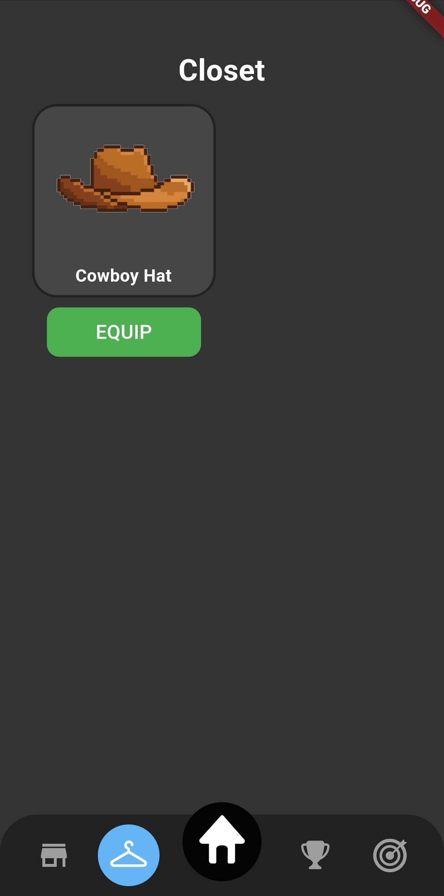

# ⚡ SparkPet 🐕
Keep walking - your pet's life depends on it

## Motivation
Many people live sedentary lifestyles and lack the motivation to exercise. SparkPet is a mobile app that encourages users to exercise by gamifying movement. The app allows users to create a virtual pet that they must keep alive by walking - the pet's health is directly tied to the user's walking habits. If the user fails to walk enough, their pet will die.

## Goals
* Create an accessible, easy-to-use mobile app that motivates users to create healthy, sustainable habits by gamifying exercise.

## Usage

|                                                     Home                                                      |                    Weekly History                     |
|:-------------------------------------------------------------------------------------------------------------:|:-----------------------------------------------------:|
|                                                                                             |                                  |
| This is the page that is displayed when a user first opens the app (assuming they have previously signed in). | This page displays the user's weekly walking history. |

|                                              Closet                                              |                                           Store                                           |
|:------------------------------------------------------------------------------------------------:|:-----------------------------------------------------------------------------------------:|
|                                                                              |                                                                        |
| A list of the items a user has acquired. The user can equip items to their pet from this screen. | The in-app store. Players can spend in-game currency here to buy new items for their pet. |

## Installation

*Requirements: [Flutter](https://docs.flutter.dev/get-started/install)*

1. Clone [SparkPet](https://github.com/Spark-Pet/spark_pet) to your local machine.
2. Start an emulator or connect a mobile device.
3. Run the command `flutter run` from the root of the repository.

## Development status
Phase I (early development)

[View current project board](https://github.com/orgs/Spark-Pet/projects/1)

## About us
Created by [Rob Godfrey](https://robertgodfrey.github.io/)